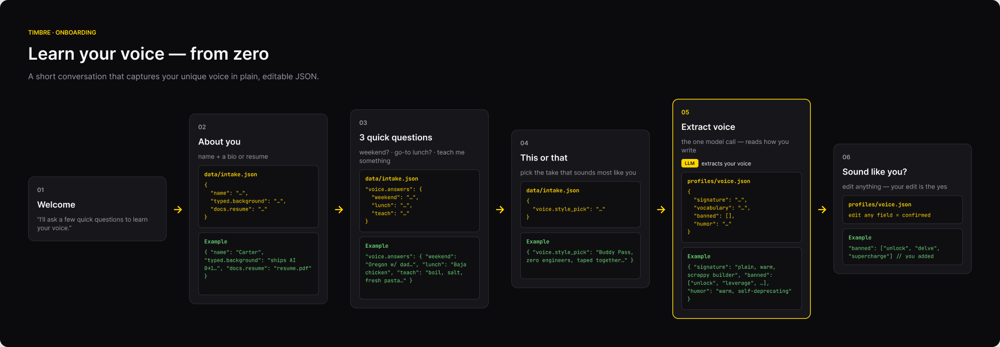
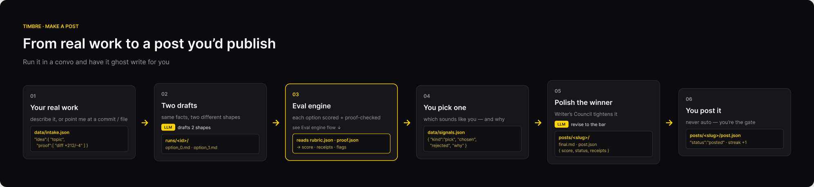
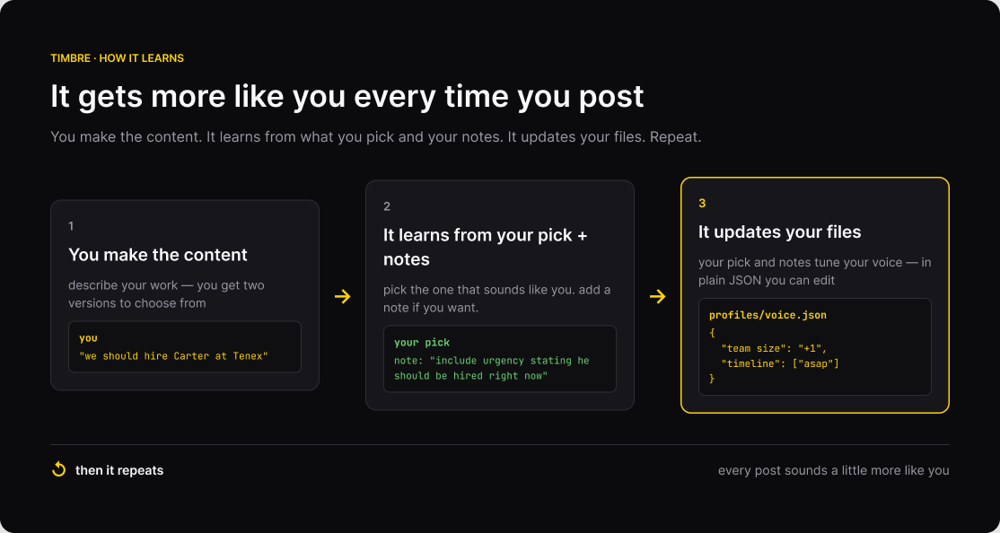
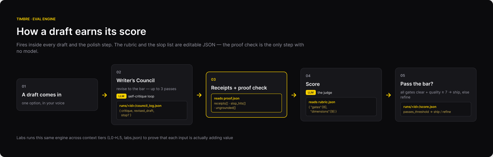
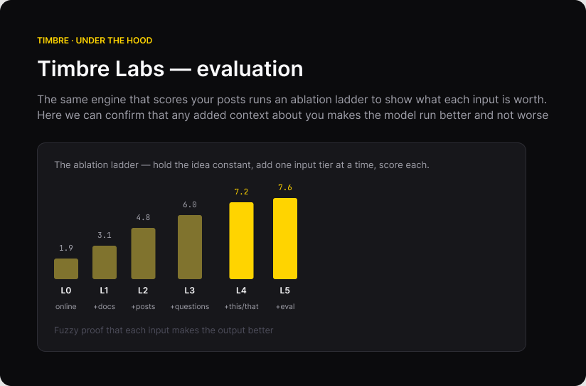

# Timbre

**Using AI to increase the distribution of your *actual* voice.**

## What

A Claude Code plugin that learns your voice and writing style, then highlights your
authenticity as you create content — so the posts you make sound like you, never like AI slop.

<p align="center">
  
</p>

## Quickstart

```bash
git clone https://github.com/CaliforniaCarter/Build-First.git
cd Build-First
uv tool install --editable .    # installs the `tb` command globally — works in any terminal
```

Then install the plugin into Claude Code (one time). Launch `claude` from the repo folder and run:

```
/plugin marketplace add ./.claude-plugin
/plugin install timbre@timbre-local
```

From now on, in **any** Claude Code session, from **any** directory:

- **`/timbre:onboard`** — a browser page opens; a quick ~10-minute onboarding captures your
  voice into local files. No account, no API key.
- **`/timbre:post`** — turn what you shipped into a post in your voice. Two options, receipts
  attached; you pick and approve. It never auto-posts.

> Keep the cloned folder where it is — the global `tb` and the plugin both point back to it.
> After editing plugin files, run `/reload-plugins` in Claude Code to pick up the changes.

## Commands

| Command | What it does |
| --- | --- |
| `/timbre:onboard` | Capture your voice from a cold start — opens a quick ~10-minute browser onboarding. |
| `/timbre:post` | Turn real work into two post options in your voice; you pick and approve. Never auto-posts. |
| `/timbre:voice` | View and edit your voice profile in plain words — your edit *is* the confirmation. |
| `/timbre:learn` | Fold this session's picks + edits into your voice (batched, on your consent). |
| `/timbre:reset` | Clear all local Timbre data for a fresh cold start (handy for demos). |

<p align="center">
  
</p>

## Why

- AI is becoming a great companion to help you write content.
- But people will tune out if every post is written in the same AI-slop way.

Timbre keeps the leverage of AI while protecting the thing that actually earns attention: your authentic voice.

## How

- A quick **10-minute onboarding** grabs the pieces that make you unique — how you actually
  write, pulled from raw answers and your real writing samples.
- It **keeps learning** from the way you edit and, ultimately, from what you end up posting.

<p align="center">
  
</p>

- **Anti-slop by design:** every draft carries a proof check — receipts required, banned phrases
  blocked, every number traced back to your own material. If it can't ground a claim, it asks
  instead of inventing.

<p align="center">
  
</p>

## Impact

- Increase the amount of authentic content you can produce.

## Tech choices & trade-offs

- **Plugin-first.** I wanted to meet the team where they already work. I traded the broad reach
  of a full front-end (and the API key it would need) for focus and simplicity — the AI runs
  key-free through Claude Code itself. For a company-wide push like the Tenex Content Showcase, a
  plugin felt like the right fit.
- **Onboarding: a clean local UI, intake-only.** I started with a full web onboarding, but a
  hosted app added complexity — a separate web app, an API key, copy that was harder to edit. So
  the onboarding page is *pure intake*: it collects your answers into JSON locally and hands off
  to the terminal for the AI steps. A clean first impression, no key, no cloud. For now...
- **JSON as the source of truth.** Your intake, voice profile, and posts are all plain,
  hand-editable JSON. Your edit *is* the confirmation; the model never over-trusts its own
  extraction.
- **Deterministic, with the LLM only where it counts.** The flow is deterministic code; the
  model is reserved for the few steps that genuinely need judgment (voice extraction, drafting).
  Cheaper, more predictable, and easier to trust.
- **A simple stack, on purpose.** I skipped heavier agent frameworks (e.g. LangGraph) to have structure be more interpretable 
- **Evaluation built in.** `tb labs` measures what each input is actually worth, so onboarding
  earns its questions instead of guessing.

<p align="center">
  
</p>

## Roadmap

- **MCP / model-agnostic** — run Timbre in any terminal, IDE, or agent, with any model.
- **Local idea-mining** — a local model quietly ingests what you're already working on and ranks
  it for novelty and interestingness, surfacing content ideas from your real workflow with no
  effort from you.
- **Analytics + posting** — pull performance straight from LinkedIn, X, and other platforms
  (and, opt-in, auto-post).
- **Zero housekeeping** — just confirm the posts you actually put online, so your library and
  streaks stay honest with no manual bookkeeping.
- **Brand** - have it start to build your brand vs just a voice (more context)
